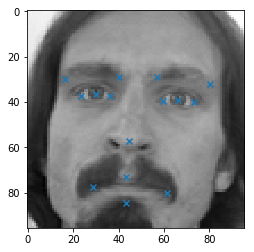
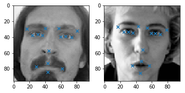

# 数据观察与处理


```python
import math
import matplotlib.pyplot as plt
import numpy as np
import pandas as pd
from sklearn.cross_validation import train_test_split
import tensorflow as tf
from util import *
%matplotlib inline
```

    D:\suyako-to-be-coder\python-env\tf-gpu\lib\site-packages\sklearn\cross_validation.py:41: DeprecationWarning: This module was deprecated in version 0.18 in favor of the model_selection module into which all the refactored classes and functions are moved. Also note that the interface of the new CV iterators are different from that of this module. This module will be removed in 0.20.
      "This module will be removed in 0.20.", DeprecationWarning)
    

首先用pandas浏览数据大致情况


```python
train = pd.read_csv('./data/training.csv')
train.head()
```


<div>
<style scoped>
    .dataframe tbody tr th:only-of-type {
        vertical-align: middle;
    }

    .dataframe tbody tr th {
        vertical-align: top;
    }

    .dataframe thead th {
        text-align: right;
    }
</style>
<table border="1" class="dataframe">
  <thead>
    <tr style="text-align: right;">
      <th></th>
      <th>left_eye_center_x</th>
      <th>left_eye_center_y</th>
      <th>right_eye_center_x</th>
      <th>right_eye_center_y</th>
      <th>left_eye_inner_corner_x</th>
      <th>left_eye_inner_corner_y</th>
      <th>left_eye_outer_corner_x</th>
      <th>left_eye_outer_corner_y</th>
      <th>right_eye_inner_corner_x</th>
      <th>right_eye_inner_corner_y</th>
      <th>...</th>
      <th>nose_tip_y</th>
      <th>mouth_left_corner_x</th>
      <th>mouth_left_corner_y</th>
      <th>mouth_right_corner_x</th>
      <th>mouth_right_corner_y</th>
      <th>mouth_center_top_lip_x</th>
      <th>mouth_center_top_lip_y</th>
      <th>mouth_center_bottom_lip_x</th>
      <th>mouth_center_bottom_lip_y</th>
      <th>Image</th>
    </tr>
  </thead>
  <tbody>
    <tr>
      <th>0</th>
      <td>66.033564</td>
      <td>39.002274</td>
      <td>30.227008</td>
      <td>36.421678</td>
      <td>59.582075</td>
      <td>39.647423</td>
      <td>73.130346</td>
      <td>39.969997</td>
      <td>36.356571</td>
      <td>37.389402</td>
      <td>...</td>
      <td>57.066803</td>
      <td>61.195308</td>
      <td>79.970165</td>
      <td>28.614496</td>
      <td>77.388992</td>
      <td>43.312602</td>
      <td>72.935459</td>
      <td>43.130707</td>
      <td>84.485774</td>
      <td>238 236 237 238 240 240 239 241 241 243 240 23...</td>
    </tr>
    <tr>
      <th>1</th>
      <td>64.332936</td>
      <td>34.970077</td>
      <td>29.949277</td>
      <td>33.448715</td>
      <td>58.856170</td>
      <td>35.274349</td>
      <td>70.722723</td>
      <td>36.187166</td>
      <td>36.034723</td>
      <td>34.361532</td>
      <td>...</td>
      <td>55.660936</td>
      <td>56.421447</td>
      <td>76.352000</td>
      <td>35.122383</td>
      <td>76.047660</td>
      <td>46.684596</td>
      <td>70.266553</td>
      <td>45.467915</td>
      <td>85.480170</td>
      <td>219 215 204 196 204 211 212 200 180 168 178 19...</td>
    </tr>
    <tr>
      <th>2</th>
      <td>65.057053</td>
      <td>34.909642</td>
      <td>30.903789</td>
      <td>34.909642</td>
      <td>59.412000</td>
      <td>36.320968</td>
      <td>70.984421</td>
      <td>36.320968</td>
      <td>37.678105</td>
      <td>36.320968</td>
      <td>...</td>
      <td>53.538947</td>
      <td>60.822947</td>
      <td>73.014316</td>
      <td>33.726316</td>
      <td>72.732000</td>
      <td>47.274947</td>
      <td>70.191789</td>
      <td>47.274947</td>
      <td>78.659368</td>
      <td>144 142 159 180 188 188 184 180 167 132 84 59 ...</td>
    </tr>
    <tr>
      <th>3</th>
      <td>65.225739</td>
      <td>37.261774</td>
      <td>32.023096</td>
      <td>37.261774</td>
      <td>60.003339</td>
      <td>39.127179</td>
      <td>72.314713</td>
      <td>38.380967</td>
      <td>37.618643</td>
      <td>38.754115</td>
      <td>...</td>
      <td>54.166539</td>
      <td>65.598887</td>
      <td>72.703722</td>
      <td>37.245496</td>
      <td>74.195478</td>
      <td>50.303165</td>
      <td>70.091687</td>
      <td>51.561183</td>
      <td>78.268383</td>
      <td>193 192 193 194 194 194 193 192 168 111 50 12 ...</td>
    </tr>
    <tr>
      <th>4</th>
      <td>66.725301</td>
      <td>39.621261</td>
      <td>32.244810</td>
      <td>38.042032</td>
      <td>58.565890</td>
      <td>39.621261</td>
      <td>72.515926</td>
      <td>39.884466</td>
      <td>36.982380</td>
      <td>39.094852</td>
      <td>...</td>
      <td>64.889521</td>
      <td>60.671411</td>
      <td>77.523239</td>
      <td>31.191755</td>
      <td>76.997301</td>
      <td>44.962748</td>
      <td>73.707387</td>
      <td>44.227141</td>
      <td>86.871166</td>
      <td>147 148 160 196 215 214 216 217 219 220 206 18...</td>
    </tr>
  </tbody>
</table>
<p>5 rows × 31 columns</p>
</div>


这里列出了前五张图的信息，从left_eye_center_x到mouth_center_bottom_lip_y为每张图片已经标记的各个特征点的位置，最后的Image列则是这张图片上每一个点的灰度值，为了直观起见我在这里还原第一张图片。

首先Image列在这里是以字符串的形式存储的，所以首先要将其转为数组，我们可以据此构造一个预处理函数。


```python
# def preprocess(x):
#     """将所有灰度值转为0-1的数值"""
#     return np.array(list(map(int, x.split()))) / 255
```

然后我们提取第一张图片的信息并画图


```python
first_image = train[0:1]  # 需注意pandas切片操作
img = preprocess(train['Image'][0])
features = train[train.columns[:-1]].values[0]
img = img.reshape((96, 96))
plt.imshow(img, cmap='gray')
plt.scatter(features[0::2], features[1::2], marker='x')
```


    <matplotlib.collections.PathCollection at 0x18b0220a470>





通过图片反应就很直观了，我们的最终的目的就是构建一个模型，将这张灰度图作为输入，然后求得图上的这些特征点的坐标。

在这里为了之后提取与处理数据方便起见，我们先将上面涉及到的一些操作写为函数的形式。


```python
# def load_train():
#     train = pd.read_csv('./data/training.csv')
#     x = np.vstack(train['Image'].apply(preprocess))
#     y = (train[train.columns[:-1]].values - 48) / 48
#     return x, y

# def load_test():
#     test = pd.read_csv('./data/test.csv')
#     return np.vstack(test['Image'].apply(preprocess))

# def plot_sample(image, features):
#     img = image.reshape((96, 96))
#     plt.imshow(img, cmap='gray')
#     plt.scatter(features[0::2] * 48 + 48, features[1::2] * 48 + 48, marker='x')
```

需要注意以下几点：
* load_train返回x与y作为训练数据，x作为输入值，y作为输出值，我们需要通过这些来训练模型；
* 对于load_train得到的y值，我们进行了归一化处理（图片原大小为96\*96），同样的原因，在绘制时需要将坐标还原为真实坐标
* 在训练完模型后，load_test得到测试集，我们将测试集传入模型并预测特征点坐标；
* 将我们得到的特征点坐标上传给kaggle，后台会有测试集的真实特征点坐标值，以[RMSE](https://www.kaggle.com/c/facial-keypoints-detection#evaluation)作为指标来评价模型的好坏

最后让我们来看一下最终的输入输出值顺便测试一下编写的函数


```python
train_input, train_output = load_train()
train_input
```


    array([[0.93333333, 0.9254902 , 0.92941176, ..., 0.2745098 , 0.29411765,
            0.35294118],
           [0.85882353, 0.84313725, 0.8       , ..., 0.00392157, 0.00392157,
            0.00392157],
           [0.56470588, 0.55686275, 0.62352941, ..., 0.30588235, 0.30588235,
            0.30196078],
           ...,
           [0.29019608, 0.29019608, 0.29019608, ..., 0.07843137, 0.07843137,
            0.07843137],
           [0.99607843, 0.99607843, 0.99607843, ..., 0.99607843, 0.99607843,
            0.99607843],
           [0.20784314, 0.24313725, 0.2627451 , ..., 0.61960784, 0.61960784,
            0.62352941]])


```python
test_input = load_test()
test_input
```


    array([[0.71372549, 0.71764706, 0.71372549, ..., 0.03137255, 0.01960784,
            0.01960784],
           [0.29803922, 0.34117647, 0.31764706, ..., 0.89411765, 0.82745098,
            0.65882353],
           [0.69411765, 0.69019608, 0.68235294, ..., 0.00392157, 0.00392157,
            0.00392157],
           ...,
           [0.10980392, 0.10980392, 0.11372549, ..., 0.30196078, 0.30588235,
            0.30588235],
           [0.40784314, 0.37254902, 0.27843137, ..., 0.56470588, 0.59215686,
            0.62352941],
           [0.24705882, 0.23921569, 0.25098039, ..., 0.44313725, 0.43921569,
            0.44313725]])


```python
plt.subplot(121)
plot_sample(train_input[0], train_output[0])
plt.subplot(122)
plot_sample(train_input[1], train_output[1])
```





# 第一个简单模型

我们首先会从一个传统的神经网络开始做第一个模型，然后再转到深度神经网络。

有了上一篇中提取到的数据，似乎就可以开始搭模型了，但这里还有一个需要注意的地方，因为我们尚未对数据进行清理。


```python
train.info()
```

    <class 'pandas.core.frame.DataFrame'>
    RangeIndex: 7049 entries, 0 to 7048
    Data columns (total 31 columns):
    left_eye_center_x            7039 non-null float64
    left_eye_center_y            7039 non-null float64
    right_eye_center_x           7036 non-null float64
    right_eye_center_y           7036 non-null float64
    left_eye_inner_corner_x      2271 non-null float64
    left_eye_inner_corner_y      2271 non-null float64
    left_eye_outer_corner_x      2267 non-null float64
    left_eye_outer_corner_y      2267 non-null float64
    right_eye_inner_corner_x     2268 non-null float64
    right_eye_inner_corner_y     2268 non-null float64
    right_eye_outer_corner_x     2268 non-null float64
    right_eye_outer_corner_y     2268 non-null float64
    left_eyebrow_inner_end_x     2270 non-null float64
    left_eyebrow_inner_end_y     2270 non-null float64
    left_eyebrow_outer_end_x     2225 non-null float64
    left_eyebrow_outer_end_y     2225 non-null float64
    right_eyebrow_inner_end_x    2270 non-null float64
    right_eyebrow_inner_end_y    2270 non-null float64
    right_eyebrow_outer_end_x    2236 non-null float64
    right_eyebrow_outer_end_y    2236 non-null float64
    nose_tip_x                   7049 non-null float64
    nose_tip_y                   7049 non-null float64
    mouth_left_corner_x          2269 non-null float64
    mouth_left_corner_y          2269 non-null float64
    mouth_right_corner_x         2270 non-null float64
    mouth_right_corner_y         2270 non-null float64
    mouth_center_top_lip_x       2275 non-null float64
    mouth_center_top_lip_y       2275 non-null float64
    mouth_center_bottom_lip_x    7016 non-null float64
    mouth_center_bottom_lip_y    7016 non-null float64
    Image                        7049 non-null object
    dtypes: float64(30), object(1)
    memory usage: 1.7+ MB
    

总共7049幅训练图，并不是所有训练图都给出了完整的特征点坐标，这对之后的训练是非常不利的。为了简化起见，我们的第一个模型将只考虑拥有所有30个完整特征点信息的图，在接下来的分析中你会看到这种图只占了所有训练图的30%，但是没关系，这只是一个起步而已。


```python
integ_index = train.dropna().index
integ_train_input = train_input[integ_index]
integ_train_output = train_output[integ_index]
integ_index
```


    Int64Index([   0,    1,    2,    3,    4,    5,    6,    7,    8,    9,
                ...
                2272, 2273, 2274, 2275, 2276, 2277, 2278, 2281, 2282, 2283],
               dtype='int64', length=2140)


现在有了完整的数据集就可以开始搭建我们的模型了，关于神经网络的开源库有很多，像是sklearn,pytorch与tensorflow等，在这里我使用的是tensorflow


```python
images_placeholder = tf.placeholder("float", [None, 9216])
features_placeholder = tf.placeholder("float", [None, 30])
glorot_initial = tf.contrib.layers.xavier_initializer()
```


```python
with tf.name_scope("hidden") as scope:
    W = tf.get_variable("W", shape=[9216, 100], initializer=glorot_initial)
    b = tf.get_variable("b", shape=[100], initializer=glorot_initial)
    hidden = tf.nn.relu(tf.matmul(images_placeholder, W) + b)
```


```python
with tf.name_scope("output") as scope:
    W = tf.get_variable("output/W", shape=[100, 30], initializer=glorot_initial)
    b = tf.get_variable("output/b", shape=[30], initializer=glorot_initial)
    features_placeholder = tf.matmul(hidden, W) + b
```


```python
# with tf.name_scope("hidden") as scope:
#     W = tf.Variable(tf.truncated_normal([9216, 100], stddev=1.0 / math.sqrt(9216)), name='weights')
#     b = tf.Variable(tf.zeros([100]), name="biases")
#     hidden = tf.nn.relu(tf.matmul(images_placeholder, W) + b)
```


```python
# with tf.name_scope("output") as scope:
#     W = tf.Variable(tf.truncated_normal([100, 30], stddev=1.0 / 10), name='weights')
#     b = tf.Variable(tf.zeros([30]), name="biases")
#     features_placeholder = tf.matmul(hidden, W) + b
```


```python
real_features_placeholder = tf.placeholder("float", [None, 30])
```


```python
MSE = tf.reduce_mean((real_features_placeholder - features_placeholder)*(real_features_placeholder - features_placeholder))
train_step = tf.train.MomentumOptimizer(learning_rate=0.01, momentum=0.9, use_nesterov=True).minimize(MSE)
init = tf.global_variables_initializer()
```


```python
sess = tf.Session()
sess.run(init)
```

构建完训练图，在最终开始训练前，我们需要对训练集进行划分，一部分作为真正的训练集，另一部分用来作为验证集


```python
X_train, X_test, Y_train, Y_test = train_test_split(integ_train_input, integ_train_output, test_size=0.2)
```


```python
def batch(X, y, size=50):
    N = len(X)
#     p = np.random.randint(N, size=size)
    p = np.arange(N)
    np.random.shuffle(p)
#     i = 0
    while True:
#         yield X[p], y[p]
        yield X[p[:50]], y[p[:50]]
        p = np.hstack((p[50:], p[:50]))
```


```python
train_mse = list()
test_mse = list()
for i, (batchx, batchy) in enumerate(batch(X_train, Y_train, size=10)):
    if i < 1000:
        sess.run(train_step, feed_dict={images_placeholder: batchx, real_features_placeholder: batchy})
#         print(sess.run(MSE, feed_dict={images_placeholder: X_train, real_features_placeholder: Y_train}))
        train_mse.append(sess.run(MSE, feed_dict={images_placeholder: X_train, real_features_placeholder: Y_train}))
        test_mse.append(sess.run(MSE, feed_dict={images_placeholder: X_test, real_features_placeholder: Y_test}))
        print(i, train_mse[-1], test_mse[-1])
    else:
        print('done')
        break
```

    0 0.41170657 0.41298437
    1 0.5805724 0.59147954
    2 0.15063536 0.15356775
    3 0.115474075 0.11712616
    4 0.10302105 0.10509772
    5 0.092316546 0.09390584
    6 0.081486896 0.08313419
    7 0.0747785 0.076344036
    8 0.06995533 0.07103265
    9 0.06369747 0.06525288
    10 0.05733528 0.058592506
    11 0.05267299 0.05396334
    12 0.047919244 0.049252328
    13 0.04271155 0.044099886
    14 0.039114747 0.04045975
    15 0.034729768 0.036247984
    16 0.03285376 0.03417948
    17 0.030096017 0.031740215
    18 0.027051864 0.028343163
    19 0.02526692 0.026868237
    20 0.02337376 0.024765616
    21 0.021158982 0.022751706
    22 0.021057904 0.022889564
    23 0.019720547 0.021058721
    24 0.018781602 0.020255735
    25 0.018482389 0.020046405
    26 0.019476013 0.02046184
    27 0.021200286 0.023237852
    28 0.02529665 0.026021255
    29 0.025062302 0.027330695
    30 0.03547695 0.035968244
    31 0.03807898 0.040616404
    32 0.021673026 0.022564612
    33 0.020970432 0.022655822
    34 0.021930864 0.022788364
    35 0.024082258 0.0256617
    36 0.017788423 0.018814826
    37 0.017093122 0.018692065
    38 0.016066467 0.017250476
    39 0.017328337 0.018837223
    40 0.017531658 0.0185117
    41 0.018030787 0.019530121
    42 0.021913126 0.02268035
    43 0.018777803 0.020506918
    44 0.014930941 0.016195174
    45 0.016436396 0.017321894
    46 0.015048508 0.016501185
    47 0.015127195 0.016562989
    48 0.014372359 0.015623297
    49 0.014218728 0.015557436
    50 0.014112502 0.01538802
    51 0.0150606 0.01604004
    52 0.015086718 0.016352635
    53 0.017621307 0.018329259
    54 0.017020693 0.018673968
    55 0.02185796 0.02238215
    56 0.023396997 0.025657475
    57 0.021364834 0.022018138
    58 0.018551834 0.020495031
    59 0.014297239 0.015226529
    60 0.013502622 0.0147321895
    61 0.013313032 0.0144786015
    62 0.013118304 0.014448298
    63 0.012891885 0.014053415
    64 0.012885344 0.013893833
    65 0.012722252 0.013892693
    66 0.012801839 0.01409761
    67 0.01266959 0.0138917025
    68 0.012733141 0.0137128085
    69 0.012710047 0.013823612
    70 0.012724963 0.013637109
    71 0.013851111 0.015489185
    72 0.01315473 0.0141547
    73 0.013790889 0.015372533
    74 0.013721908 0.014573672
    75 0.012977591 0.014394198
    76 0.013381941 0.014262515
    77 0.012577926 0.014039887
    78 0.011999496 0.0132582085
    79 0.012133145 0.01312577
    80 0.01204405 0.013255927
    81 0.011982007 0.013143837
    82 0.011694104 0.012888799
    83 0.011956792 0.01333038
    84 0.012088712 0.013260444
    85 0.01181535 0.012995585
    86 0.01264382 0.013430275
    87 0.0116546415 0.012895459
    88 0.012861083 0.013693288
    89 0.011821518 0.012946614
    90 0.011649246 0.012998114
    91 0.011526574 0.012775219
    92 0.011437276 0.01254123
    93 0.011682778 0.012998162
    94 0.011663458 0.012578709
    95 0.011465026 0.012814559
    96 0.01187102 0.012859677
    97 0.012262998 0.0137420595
    98 0.01267059 0.013475517
    99 0.012629748 0.014029906
    100 0.011341877 0.012332228
    101 0.012518175 0.014114919
    102 0.015237996 0.01570727
    103 0.015106391 0.016868679
    104 0.015721817 0.0163003
    105 0.014769298 0.016571213
    106 0.014193262 0.0149351265
    107 0.012927854 0.014597396
    108 0.011151539 0.012179128
    109 0.010871806 0.012149203
    110 0.011124122 0.012144126
    111 0.011037323 0.012427073
    112 0.010972367 0.012320913
    113 0.010943418 0.011936992
    114 0.010961481 0.012115038
    115 0.010808296 0.011808788
    116 0.011301498 0.012756261
    117 0.010627231 0.0119253965
    118 0.010767996 0.012036533
    119 0.0114279175 0.012425227
    120 0.011260907 0.012119688
    121 0.010553476 0.01175335
    122 0.01118388 0.012004929
    123 0.010531471 0.011810876
    124 0.0104700485 0.0115370825
    125 0.010403373 0.01170308
    126 0.010304681 0.011485514
    127 0.010231819 0.011377382
    128 0.010330608 0.011376043
    129 0.010184315 0.0113846725
    130 0.010542338 0.011749535
    131 0.010463104 0.011756333
    132 0.010331514 0.011414095
    133 0.010118557 0.011298685
    134 0.01007737 0.011155627
    135 0.01149218 0.013092614
    136 0.01234259 0.013058606
    137 0.012435297 0.014035381
    138 0.0143785095 0.014899877
    139 0.012023615 0.013644755
    140 0.010747749 0.011709723
    141 0.010545682 0.0119983945
    142 0.009965105 0.011048663
    143 0.0098673515 0.011007929
    144 0.010089348 0.011425414
    145 0.010136108 0.011215851
    146 0.009999072 0.011251583
    147 0.009807383 0.010916962
    148 0.010088717 0.01106533
    149 0.009809588 0.010854599
    150 0.0101587325 0.0115466155
    151 0.009892531 0.011148714
    152 0.009968085 0.011320156
    153 0.010297947 0.01124129
    154 0.009962526 0.010961128
    155 0.009745422 0.010905312
    156 0.010413291 0.011282724
    157 0.009741621 0.010965649
    158 0.010151782 0.011123274
    159 0.010997707 0.012625203
    160 0.010107346 0.011125533
    161 0.009624578 0.010820039
    162 0.009745966 0.011013293
    163 0.010436296 0.011284804
    164 0.010040417 0.011426992
    165 0.009782124 0.010858841
    166 0.010056084 0.011522468
    167 0.009864279 0.010892648
    168 0.00963897 0.010739418
    169 0.010998138 0.012623685
    170 0.011497208 0.012284129
    171 0.011198949 0.012654422
    172 0.012388495 0.013045808
    173 0.011293397 0.012885449
    174 0.009848 0.010969618
    175 0.00940507 0.01066913
    176 0.00958821 0.010869624
    177 0.009699379 0.010730383
    178 0.009968537 0.011380646
    179 0.010071949 0.011021423
    180 0.009454831 0.010792817
    181 0.009331814 0.010619174
    182 0.010547368 0.01134952
    183 0.009439458 0.010745309
    184 0.0093059335 0.010547456
    185 0.009385844 0.010733146
    186 0.009295514 0.010466505
    187 0.009360538 0.010695985
    188 0.010456227 0.011276911
    189 0.009627133 0.0108865425
    190 0.010118103 0.010996532
    191 0.009652284 0.011015087
    192 0.011637421 0.0123409
    193 0.012015726 0.013814189
    194 0.010415562 0.011395064
    195 0.009428867 0.010817241
    196 0.009081947 0.010222248
    197 0.009130473 0.010209614
    198 0.009144866 0.010264309
    199 0.009202947 0.010494322
    200 0.009401264 0.010787571
    201 0.009383877 0.010444747
    202 0.0091468375 0.010419798
    203 0.00981908 0.011371835
    204 0.009171843 0.0102921855
    205 0.009040355 0.010199552
    206 0.009285004 0.010252784
    207 0.008958212 0.010090084
    208 0.009448479 0.010914327
    209 0.009159051 0.010276363
    210 0.00963127 0.011119825
    211 0.009530426 0.010510632
    212 0.009313029 0.010650782
    213 0.0095128855 0.010489361
    214 0.009112249 0.010494938
    215 0.009179682 0.010598377
    216 0.009815728 0.010676831
    217 0.009007056 0.010309304
    218 0.008956593 0.010059525
    219 0.009027035 0.0103803435
    220 0.008975501 0.0103337485
    221 0.008947033 0.010234204
    222 0.008975422 0.010073327
    223 0.009177227 0.010183305
    224 0.008868694 0.010121988
    225 0.009560531 0.010580994
    226 0.009127525 0.010214153
    227 0.009021855 0.010464739
    228 0.008786717 0.010065143
    229 0.008787766 0.009956854
    230 0.008930803 0.010236271
    231 0.008734157 0.009865351
    232 0.008624689 0.009859751
    233 0.009007341 0.010133191
    234 0.00985553 0.011456182
    235 0.009693507 0.010709319
    236 0.009094189 0.010420482
    237 0.0086563835 0.009906624
    238 0.009314437 0.010845465
    239 0.010442935 0.011252391
    240 0.009833808 0.011304744
    241 0.009082434 0.010126606
    242 0.008988741 0.010432206
    243 0.009006822 0.010083946
    244 0.009007291 0.010469378
    245 0.00849858 0.009728964
    246 0.008547607 0.009786387
    247 0.008695246 0.009800009
    248 0.008942721 0.0104215415
    249 0.008667687 0.00996785
    250 0.008616053 0.009830029
    251 0.008854539 0.009979916
    252 0.008552589 0.009672586
    253 0.0091174105 0.010597325
    254 0.008482425 0.009776558
    255 0.008734245 0.01017142
    256 0.009109722 0.010177081
    257 0.008865345 0.009923181
    258 0.008459176 0.009636671
    259 0.008566307 0.009681718
    260 0.008374914 0.009602306
    261 0.008372448 0.009638779
    262 0.008373708 0.009630794
    263 0.00841619 0.009773818
    264 0.008326682 0.009550808
    265 0.008338241 0.009572428
    266 0.00828978 0.009555433
    267 0.008486589 0.009732839
    268 0.008612107 0.010046855
    269 0.008568843 0.009746989
    270 0.00830308 0.009598126
    271 0.008273684 0.009551784
    272 0.00911435 0.010698184
    273 0.009153543 0.010151384
    274 0.0089480905 0.010311037
    275 0.009354661 0.010325259
    276 0.009023294 0.010602405
    277 0.008696377 0.009824161
    278 0.008441783 0.009863077
    279 0.008263606 0.009419806
    280 0.008191619 0.009455582
    281 0.008397487 0.009826153
    282 0.008330635 0.009596969
    283 0.008246134 0.009523404
    284 0.0082276175 0.009437094
    285 0.008283063 0.0094088735
    286 0.008307492 0.0094243605
    287 0.008725447 0.01023363
    288 0.008300774 0.00970936
    289 0.008265367 0.00963404
    290 0.008448023 0.009567548
    291 0.008585321 0.009599393
    292 0.008277363 0.0096664615
    293 0.008861344 0.00984649
    294 0.008225011 0.009603117
    295 0.0085981665 0.00967925
    296 0.008454879 0.009954786
    297 0.008132823 0.009364104
    298 0.008062838 0.00934994
    299 0.008158634 0.009521779
    300 0.008894372 0.009858184
    301 0.0084249955 0.009876515
    302 0.00827597 0.0095065385
    303 0.008603999 0.010157873
    304 0.008449143 0.009592601
    305 0.008273919 0.009510284
    306 0.0094192615 0.011105415
    307 0.009458446 0.010423902
    308 0.009057081 0.010504098
    309 0.009115539 0.0100889485
    310 0.008704189 0.010234255
    311 0.008109299 0.00942966
    312 0.007959451 0.009257058
    313 0.0081122415 0.0094793895
    314 0.008171216 0.009299708
    315 0.008316407 0.0097592
    316 0.008272966 0.009419759
    317 0.007959897 0.009338912
    318 0.008035554 0.009447831
    319 0.00953193 0.010430145
    320 0.00802558 0.009372886
    321 0.00792861 0.0092888875
    322 0.008033507 0.009457484
    323 0.007946995 0.009259192
    324 0.007936559 0.009314357
    325 0.008544964 0.00957732
    326 0.007931587 0.009204363
    327 0.00802283 0.009173781
    328 0.007959508 0.009241646
    329 0.008709036 0.009736301
    330 0.009096552 0.010772309
    331 0.00816602 0.00938145
    332 0.007827627 0.009209919
    333 0.007815336 0.009113005
    334 0.007873938 0.009049924
    335 0.007879492 0.009067857
    336 0.007912357 0.0091863
    337 0.009187121 0.01089184
    338 0.008806607 0.009908476
    339 0.008107318 0.009459806
    340 0.00890378 0.010587777
    341 0.008748764 0.00974991
    342 0.008270834 0.009726183
    343 0.008529256 0.009545232
    344 0.007931193 0.009288503
    345 0.007920034 0.009365506
    346 0.0077582914 0.009037664
    347 0.008039368 0.009511702
    348 0.008235522 0.009309257
    349 0.008099245 0.009520972
    350 0.008090267 0.00921404
    351 0.007871983 0.009313456
    352 0.007927047 0.009402526
    353 0.008410591 0.009426739
    354 0.007745371 0.009107808
    355 0.0077192504 0.008926015
    356 0.007779623 0.009165059
    357 0.007889051 0.00936011
    358 0.0078123873 0.009186679
    359 0.007835499 0.009027536
    360 0.007834137 0.009000934
    361 0.007656139 0.008968804
    362 0.008070878 0.009234548
    363 0.007922922 0.009111392
    364 0.007813409 0.009305391
    365 0.0076480005 0.008946625
    366 0.007576204 0.008922304
    367 0.00768572 0.009061515
    368 0.0076339673 0.008847276
    369 0.007567758 0.008820851
    370 0.007791915 0.009062957
    371 0.008473448 0.010098286
    372 0.007878321 0.009129743
    373 0.007602481 0.008828436
    374 0.00795614 0.0094676
    375 0.007649011 0.009058051
    376 0.007818626 0.008942956
    377 0.007789503 0.009106783
    378 0.007580119 0.008884105
    379 0.0076868837 0.009153082
    380 0.0076372675 0.008846473
    381 0.0076871547 0.009136187
    382 0.007457475 0.008734993
    383 0.0074707577 0.008763648
    384 0.007523617 0.008785176
    385 0.0076930905 0.009142998
    386 0.0075084176 0.008881683
    387 0.007492274 0.0087949345
    388 0.0076974006 0.008907166
    389 0.0075586727 0.00875612
    390 0.008104154 0.009644483
    391 0.007499497 0.008779997
    392 0.007883615 0.009444681
    393 0.00804701 0.009242932
    394 0.007777642 0.0089438
    395 0.007446511 0.008720449
    396 0.007623776 0.008816521
    397 0.007411794 0.008755827
    398 0.007402891 0.008714862
    399 0.0073848497 0.008736307
    400 0.007418032 0.008858373
    401 0.007371174 0.008656129
    402 0.0074245725 0.008829695
    403 0.007400246 0.008694992
    404 0.007784024 0.009004478
    405 0.007970941 0.009540442
    406 0.007570785 0.008934538
    407 0.0074055973 0.008691888
    408 0.007614793 0.009071707
    409 0.007902633 0.009493473
    410 0.0079115415 0.0090384185
    411 0.007740835 0.009180589
    412 0.00818439 0.009243501
    413 0.008050177 0.00967998
    414 0.0077116946 0.008932501
    415 0.0073548146 0.0087601235
    416 0.0073161 0.008724943
    417 0.007286438 0.0085754
    418 0.0074310815 0.008897313
    419 0.0073649646 0.008667542
    420 0.0072891163 0.008689501
    421 0.007310839 0.008627128
    422 0.007364305 0.0085842395
    423 0.007677974 0.008807477
    424 0.008015305 0.00958711
    425 0.007406036 0.008900447
    426 0.0074717193 0.008958961
    427 0.0076402007 0.008861746
    428 0.0076865572 0.008800531
    429 0.0072977785 0.008734124
    430 0.007916711 0.009006007
    431 0.0072336374 0.008628259
    432 0.007378823 0.008635787
    433 0.0073204013 0.008807872
    434 0.0071865427 0.008540143
    435 0.0071610413 0.0084937895
    436 0.0072707594 0.008711187
    437 0.007858475 0.00894064
    438 0.0073125027 0.008738782
    439 0.0072357985 0.008618705
    440 0.007368105 0.008877354
    441 0.007202034 0.0085570365
    442 0.0072808107 0.008577787
    443 0.008018835 0.009654725
    444 0.007929692 0.009057034
    445 0.007898894 0.009397114
    446 0.00822776 0.0092995055
    447 0.0077462415 0.009324963
    448 0.0072271875 0.0085726995
    449 0.0071151117 0.008504522
    450 0.007276655 0.00870929
    451 0.0072658127 0.008494875
    452 0.0073729656 0.0088563375
    453 0.0072879903 0.008550476
    454 0.007085857 0.008489473
    455 0.00726007 0.008745496
    456 0.008427115 0.009445967
    457 0.0071541877 0.008553315
    458 0.0070847753 0.008483374
    459 0.007245692 0.008750465
    460 0.0071094073 0.008511349
    461 0.007103866 0.008540098
    462 0.0075129475 0.008673762
    463 0.007077844 0.008409562
    464 0.0072119096 0.008437129
    465 0.007084468 0.008443347
    466 0.007662818 0.008829193
    467 0.007997359 0.009674193
    468 0.0073129106 0.008604157
    469 0.0070588407 0.008522962
    470 0.0070060324 0.008366009
    471 0.0070729433 0.0083303545
    472 0.007078771 0.008340952
    473 0.007093513 0.008454578
    474 0.008090222 0.00980739
    475 0.0076923333 0.00891736
    476 0.0071714004 0.008535313
    477 0.008206162 0.009946115
    478 0.007891417 0.008994194
    479 0.007497598 0.009001767
    480 0.0077978414 0.008878169
    481 0.0072718337 0.008733388
    482 0.007187094 0.008696348
    483 0.006988568 0.008306184
    484 0.0072586965 0.008781234
    485 0.007606294 0.008730011
    486 0.0076483754 0.0092116725
    487 0.0076970407 0.008837896
    488 0.007190052 0.008704329
    489 0.0070713684 0.008560028
    490 0.007660579 0.008764388
    491 0.0070075323 0.008455653
    492 0.0070584533 0.008316752
    493 0.0071661817 0.008639496
    494 0.0070819706 0.008596653
    495 0.0070306105 0.008497844
    496 0.007218721 0.008446752
    497 0.0070104087 0.008279954
    498 0.0068965806 0.008257895
    499 0.0070455666 0.008354306
    500 0.00745195 0.008644568
    501 0.0072950213 0.008895736
    502 0.007132745 0.008409146
    503 0.0069847796 0.008489129
    504 0.006838837 0.008211821
    505 0.006852467 0.008189115
    506 0.00702717 0.008276397
    507 0.006937588 0.008318068
    508 0.0077338316 0.009411917
    509 0.0072071063 0.008507874
    510 0.0068449574 0.00817312
    511 0.0071865 0.008739084
    512 0.0068802717 0.008310979
    513 0.007025852 0.008235739
    514 0.0069892504 0.008349915
    515 0.0068593402 0.008269921
    516 0.006930353 0.00841819
    517 0.0068288804 0.00813644
    518 0.006879617 0.008343961
    519 0.006799586 0.008094701
    520 0.0067812116 0.008188364
    521 0.006854905 0.008147073
    522 0.0068909335 0.008369731
    523 0.0067916205 0.008191559
    524 0.0068317475 0.00826795
    525 0.0071470374 0.008382811
    526 0.0068053976 0.008087444
    527 0.0072598667 0.008801511
    528 0.00675682 0.008162486
    529 0.0071417126 0.0087343
    530 0.007254096 0.008531234
    531 0.0070971576 0.008308956
    532 0.006717238 0.008069726
    533 0.0068190875 0.008109606
    534 0.0068129874 0.008131463
    535 0.0067813215 0.008279092
    536 0.0067491904 0.008085455
    537 0.0067441356 0.008237457
    538 0.00666066 0.008054069
    539 0.0067036543 0.008158906
    540 0.0068128994 0.008112917
    541 0.0071075927 0.008371161
    542 0.0075743403 0.009256995
    543 0.0069664237 0.008365874
    544 0.0067739356 0.008101042
    545 0.006924472 0.008427877
    546 0.007260579 0.008893344
    547 0.0073823105 0.008530745
    548 0.0071006184 0.008635405
    549 0.0073681353 0.00851489
    550 0.007308979 0.008959287
    551 0.00694391 0.008234197
    552 0.006683701 0.008116905
    553 0.0066942633 0.00815622
    554 0.0066278283 0.0079864785
    555 0.006656138 0.008118794
    556 0.006682841 0.00804184
    557 0.006627328 0.008091558
    558 0.006691345 0.008070641
    559 0.0067729307 0.008028655
    560 0.0069601582 0.008172164
    561 0.0074241497 0.009051328
    562 0.0066659655 0.008154082
    563 0.0067595136 0.00827525
    564 0.006807229 0.008142126
    565 0.007114958 0.0082738865
    566 0.006607183 0.008045982
    567 0.0067998595 0.00805431
    568 0.006547196 0.007968819
    569 0.006670369 0.008015227
    570 0.0065965755 0.007999866
    571 0.0066041877 0.008098145
    572 0.006526895 0.007956342
    573 0.0065582697 0.008010004
    574 0.0072032143 0.00835179
    575 0.0066754837 0.0081476625
    576 0.0066219615 0.008072023
    577 0.0068762237 0.008475713
    578 0.0067483196 0.008061306
    579 0.0066706035 0.008127422
    580 0.0070321034 0.008648557
    581 0.0070079435 0.008239538
    582 0.0069390633 0.008436327
    583 0.0072780373 0.008435268
    584 0.0071959095 0.00883137
    585 0.0066663167 0.008059952
    586 0.0065153358 0.007963234
    587 0.00651843 0.007887803
    588 0.0065272963 0.007851373
    589 0.006782622 0.0083317105
    590 0.0066878926 0.008020762
    591 0.0064896354 0.007867534
    592 0.006601924 0.008078052
    593 0.0070290477 0.008211514
    594 0.0064532235 0.0078122336
    595 0.006592679 0.008108293
    596 0.0065075383 0.007997798
    597 0.00652377 0.00801856
    598 0.0064749564 0.0079119
    599 0.0067963502 0.008039176
    600 0.006447699 0.007854919
    601 0.0066443603 0.007915878
    602 0.0064477497 0.007859797
    603 0.006821939 0.008097594
    604 0.007102888 0.008758455
    605 0.006709301 0.00802955
    606 0.006492072 0.008017666
    607 0.0064272764 0.007882946
    608 0.0066523687 0.007904546
    609 0.006420321 0.007766874
    610 0.0065294537 0.007922053
    611 0.007257337 0.008976145
    612 0.0068638693 0.008162729
    613 0.0064954883 0.007877594
    614 0.0077401428 0.009520634
    615 0.0070952824 0.008297226
    616 0.0066470066 0.00813087
    617 0.006761893 0.007970131
    618 0.0065664304 0.008058152
    619 0.0065102703 0.0080169495
    620 0.0064184912 0.007822032
    621 0.0065596513 0.008074515
    622 0.006727612 0.007960355
    623 0.0068676113 0.008450225
    624 0.0071463566 0.0083234925
    625 0.0066004125 0.008159229
    626 0.006473588 0.008001791
    627 0.0071608224 0.00831655
    628 0.006360422 0.007786918
    629 0.006352239 0.007732217
    630 0.0065946155 0.008131745
    631 0.0065103085 0.008067564
    632 0.006438051 0.0079410495
    633 0.006751982 0.008011517
    634 0.0064429697 0.007786977
    635 0.006413727 0.007772053
    636 0.0063895145 0.007864516
    637 0.007892618 0.008999421
    638 0.0075266534 0.0092766965
    639 0.0069866693 0.008253665
    640 0.0066333516 0.008233952
    641 0.0063577304 0.0077106166
    642 0.0063316887 0.007737758
    643 0.006590873 0.007863882
    644 0.006304033 0.0077476907
    645 0.0068428824 0.008497414
    646 0.0063854763 0.007784135
    647 0.0064124437 0.0077006877
    648 0.0072122472 0.008906197
    649 0.0062968647 0.007699295
    650 0.0063541234 0.007646242
    651 0.0063587534 0.007743541
    652 0.0062928377 0.0077354633
    653 0.006328574 0.007812408
    654 0.006261483 0.007692304
    655 0.0062917634 0.007756563
    656 0.0062943846 0.007612638
    657 0.0062453 0.0076741567
    658 0.0063218432 0.007650559
    659 0.006323416 0.007816437
    660 0.006294475 0.0077739963
    661 0.0062148217 0.0076164505
    662 0.0063020587 0.0076366044
    663 0.0063181445 0.0076408964
    664 0.006584137 0.008130948
    665 0.006212041 0.007682805
    666 0.0065924376 0.008215953
    667 0.006888476 0.008165167
    668 0.0064206417 0.007741656
    669 0.0061749704 0.007591618
    670 0.006343774 0.0076671815
    671 0.0063307597 0.0076972865
    672 0.006331693 0.007898028
    673 0.00625117 0.007624262
    674 0.0061825644 0.0076849717
    675 0.006140664 0.0075909183
    676 0.006177566 0.007601917
    677 0.006193691 0.007567828
    678 0.006838548 0.008084533
    679 0.0075083817 0.009278409
    680 0.006596548 0.007965766
    681 0.0062852455 0.0076995566
    682 0.0064742826 0.008021693
    683 0.006608022 0.008217765
    684 0.006964679 0.008128832
    685 0.0065181362 0.008047638
    686 0.006385562 0.007667174
    687 0.006573768 0.008188124
    688 0.006267549 0.0076267566
    689 0.006146873 0.0075960164
    690 0.006202016 0.007689818
    691 0.0061327284 0.007521831
    692 0.0061566452 0.0076419595
    693 0.0061765052 0.007588129
    694 0.0060998057 0.007567663
    695 0.0061628586 0.00756336
    696 0.0062789097 0.0075770584
    697 0.006394522 0.007652946
    698 0.007131092 0.008824988
    699 0.0061586522 0.0076700724
    700 0.006248576 0.00778114
    701 0.0064973696 0.0078083705
    702 0.0062975674 0.007598879
    703 0.0061077457 0.007497753
    704 0.0061124233 0.007588636
    705 0.0063354913 0.007673303
    706 0.0061707697 0.007667639
    707 0.0062438147 0.007593907
    708 0.0062812627 0.007863081
    709 0.0060467254 0.007497613
    710 0.00603438 0.0074734744
    711 0.0064541814 0.0076991003
    712 0.0061544282 0.00765295
    713 0.006109577 0.0075540086
    714 0.006420284 0.008051791
    715 0.0061913985 0.007556964
    716 0.006100743 0.007557368
    717 0.006599753 0.008251981
    718 0.0063182404 0.0076200766
    719 0.006212289 0.007721205
    720 0.0065455255 0.00776764
    721 0.006471793 0.008084488
    722 0.0061178976 0.0075445375
    723 0.006028599 0.0075002443
    724 0.0060260897 0.0074645616
    725 0.0060797506 0.0074195457
    726 0.0062691043 0.007835057
    727 0.0061982614 0.0075757373
    728 0.005999143 0.0074224616
    729 0.006051178 0.0075273598
    730 0.006336779 0.0076048775
    731 0.006072675 0.007405051
    732 0.006340412 0.00794581
    733 0.0059891385 0.0074849166
    734 0.006108641 0.007659735
    735 0.006044347 0.0075123287
    736 0.006502364 0.0077350237
    737 0.0060412963 0.007514331
    738 0.0061751558 0.0074996576
    739 0.005965521 0.0074116574
    740 0.0063702725 0.007682805
    741 0.0067518847 0.008462204
    742 0.0063551753 0.0076812375
    743 0.0060778908 0.0076163625
    744 0.005962117 0.0074663893
    745 0.0063407267 0.0076002274
    746 0.005926238 0.0073606838
    747 0.006038162 0.0074600955
    748 0.0063596987 0.008009115
    749 0.006006449 0.0074601527
    750 0.006069031 0.007408358
    751 0.0072728535 0.009054452
    752 0.006524452 0.0077829747
    753 0.0061196373 0.007627801
    754 0.006205798 0.007485099
    755 0.0060582943 0.007594923
    756 0.006048372 0.00758984
    757 0.0059460704 0.0073677334
    758 0.006236679 0.007825716
    759 0.006557206 0.00778905
    760 0.006560748 0.008189888
    761 0.0066481805 0.007885055
    762 0.0061558294 0.0077497526
    763 0.0059077856 0.007397384
    764 0.0062095844 0.0075175515
    765 0.005876833 0.007295189
    766 0.0058962717 0.007380249
    767 0.0059727877 0.0074922713
    768 0.00598957 0.0075443843
    769 0.0059853736 0.007537635
    770 0.006303475 0.0076220264
    771 0.0059910268 0.007384024
    772 0.005947247 0.007349208
    773 0.00591855 0.0073870947
    774 0.0069499803 0.008156447
    775 0.0068066427 0.008543168
    776 0.006447203 0.007752873
    777 0.006249989 0.00790224
    778 0.005862642 0.0072874986
    779 0.005884535 0.007275633
    780 0.00607385 0.007388175
    781 0.0059081204 0.007356319
    782 0.0062312437 0.0078531075
    783 0.005916146 0.007377678
    784 0.0058499807 0.007251496
    785 0.006499097 0.008173741
    786 0.0058558537 0.0073286155
    787 0.005991652 0.0072986586
    788 0.0059558405 0.0073994915
    789 0.0058203647 0.007256619
    790 0.0059435465 0.0074971747
    791 0.005826153 0.007257598
    792 0.005866771 0.0073732277
    793 0.005809203 0.007197367
    794 0.005798731 0.0072489223
    795 0.005862467 0.007249174
    796 0.00585646 0.0073768236
    797 0.005848788 0.007357668
    798 0.00578735 0.00721215
    799 0.0058531063 0.007246557
    800 0.005942623 0.007284375
    801 0.0062960736 0.007896203
    802 0.0057566944 0.007225924
    803 0.006171184 0.007808608
    804 0.0063542128 0.0077002756
    805 0.0060364124 0.0073640225
    806 0.0057597747 0.0072482205
    807 0.005875228 0.007252069
    808 0.0058591794 0.0072756927
    809 0.0057822657 0.0073235603
    810 0.0057792147 0.007214428
    811 0.0057327487 0.0072358283
    812 0.005786921 0.0073291343
    813 0.0058351033 0.0072050034
    814 0.0057267128 0.007166217
    815 0.006415561 0.007697005
    816 0.00717116 0.008977239
    817 0.006312502 0.007657306
    818 0.0059651034 0.007523267
    819 0.0058071697 0.0072918474
    820 0.0061350884 0.0077523235
    821 0.0064524543 0.0076732053
    822 0.006076533 0.0076367664
    823 0.0058644754 0.007215195
    824 0.0061381543 0.0077721965
    825 0.0058677755 0.007254564
    826 0.005729803 0.0072235228
    827 0.0057251183 0.0071972236
    828 0.005710408 0.007156407
    829 0.0057111937 0.007138641
    830 0.005763781 0.0072840312
    831 0.005718689 0.007187541
    832 0.00573275 0.007201023
    833 0.005879544 0.0072307633
    834 0.0060114656 0.0073083136
    835 0.006580518 0.008267187
    836 0.0056967554 0.007203232
    837 0.005958446 0.007560909
    838 0.006267608 0.007615195
    839 0.0059425463 0.007273205
    840 0.005693729 0.0071450802
    841 0.005670152 0.007135555
    842 0.006026922 0.007353313
    843 0.005897698 0.0075004394
    844 0.005877001 0.0072340565
    845 0.0058239517 0.0074071726
    846 0.0056447275 0.007148106
    847 0.005674444 0.0070948866
    848 0.0057286597 0.0071177944
    849 0.00573184 0.0071600103
    850 0.005689884 0.007210575
    851 0.0058448357 0.0074451976
    852 0.005734159 0.007155944
    853 0.005709961 0.007210594
    854 0.006080468 0.0077193524
    855 0.0058496254 0.0071884915
    856 0.0058011296 0.007338651
    857 0.0060788402 0.007345891
    858 0.0061176848 0.0077644475
    859 0.0057618185 0.007159711
    860 0.005627746 0.0071249595
    861 0.0056136395 0.0070734364
    862 0.005673049 0.007038033
    863 0.005857833 0.007434559
    864 0.0058007604 0.0071956315
    865 0.005622524 0.00706985
    866 0.0056593567 0.0071504065
    867 0.005870459 0.0071761794
    868 0.005692263 0.0070485603
    869 0.0059413817 0.007562239
    870 0.005585557 0.0070894556
    871 0.0057856385 0.0073830625
    872 0.0056850673 0.0071363407
    873 0.0060970187 0.0073653283
    874 0.00569547 0.007214643
    875 0.0059907 0.0072954576
    876 0.005642026 0.007190063
    877 0.0063162697 0.0076061017
    878 0.0064176377 0.00814282
    879 0.0058079246 0.007194766
    880 0.005642118 0.007191328
    881 0.0055953125 0.0071276836
    882 0.006211998 0.007456919
    883 0.0055612666 0.0070381924
    884 0.005638099 0.0070832036
    885 0.0060279453 0.007704634
    886 0.005672891 0.007119351
    887 0.0055941525 0.007016219
    888 0.0063007795 0.008000204
    889 0.005799438 0.0071396898
    890 0.0056599216 0.0071661514
    891 0.005797853 0.0071140206
    892 0.0057874448 0.007380907
    893 0.005629012 0.0071619395
    894 0.0055563217 0.0069865817
    895 0.005700579 0.007262607
    896 0.0057519977 0.007092057
    897 0.0058606835 0.0074621006
    898 0.006004489 0.007305532
    899 0.0055765086 0.0071222335
    900 0.0056637647 0.007243043
    901 0.0062255966 0.007498855
    902 0.005543638 0.0069507505
    903 0.005720397 0.00732541
    904 0.0055098776 0.0070212986
    905 0.005529894 0.007037282
    906 0.005686502 0.0073002623
    907 0.0062595746 0.0075423922
    908 0.0056562517 0.0071925283
    909 0.00587318 0.0072073587
    910 0.005615163 0.007176705
    911 0.0064932946 0.0077437437
    912 0.0062223985 0.007941022
    913 0.00586834 0.007233476
    914 0.0056112735 0.0072002052
    915 0.0054839393 0.0070058624
    916 0.0056102574 0.006970875
    917 0.0055564255 0.0069410154
    918 0.0055668848 0.007026681
    919 0.005827901 0.007464081
    920 0.005528559 0.0069973897
    921 0.005462044 0.0069369287
    922 0.005979586 0.0076537523
    923 0.005506956 0.0069166073
    924 0.005478629 0.0069377935
    925 0.0055493885 0.006919122
    926 0.0054746484 0.0069526685
    927 0.0057320865 0.007358753
    928 0.0055300286 0.0069608847
    929 0.005528157 0.007067719
    930 0.0055391304 0.0069101043
    931 0.0055052866 0.0070105046
    932 0.005587339 0.006957302
    933 0.005519904 0.007064355
    934 0.005542736 0.007102215
    935 0.005544873 0.006930876
    936 0.0054635094 0.006893591
    937 0.005464888 0.0068834377
    938 0.005658526 0.00722821
    939 0.0054018847 0.0068993494
    940 0.0058857272 0.007567756
    941 0.0058957497 0.00727427
    942 0.0057778936 0.0070997435
    943 0.005506362 0.007060492
    944 0.0055405744 0.0069595217
    945 0.0056994953 0.0070753284
    946 0.0055011166 0.0070807557
    947 0.0054185046 0.0068861465
    948 0.0053806757 0.006878758
    949 0.0055340026 0.0071309204
    950 0.005576454 0.0069362093
    951 0.005393415 0.0068414016
    952 0.006004596 0.0073163076
    953 0.006820478 0.008635319
    954 0.0061340937 0.007457247
    955 0.005694837 0.0072876625
    956 0.005511403 0.007064168
    957 0.005510064 0.007057719
    958 0.005675781 0.0069809696
    959 0.0055822395 0.007130026
    960 0.005377956 0.0068090195
    961 0.0055407193 0.007115915
    962 0.0054739136 0.006880287
    963 0.005419975 0.0069616186
    964 0.005340481 0.0067983717
    965 0.005367662 0.0068099727
    966 0.0053747217 0.0068076155
    967 0.005495593 0.0070626405
    968 0.0053975726 0.0068629035
    969 0.005438563 0.0069572697
    970 0.0056021847 0.006962737
    971 0.0056998315 0.007013542
    972 0.0063694594 0.008083573
    973 0.0053314627 0.0068477094
    974 0.0056765545 0.0072989203
    975 0.0058778105 0.007269722
    976 0.00570057 0.0070230574
    977 0.005350984 0.0068339505
    978 0.0053296443 0.0068233786
    979 0.0057435622 0.0070900773
    980 0.005566461 0.007173834
    981 0.005634958 0.00699015
    982 0.0056570047 0.0073036877
    983 0.0053144563 0.00680779
    984 0.00530507 0.006787322
    985 0.005455633 0.0068307733
    986 0.005390973 0.006832572
    987 0.005468498 0.007073252
    988 0.0053778593 0.0069067357
    989 0.0053185914 0.0067819706
    990 0.005379261 0.006930118
    991 0.005604416 0.0072208433
    992 0.0054628677 0.0068253702
    993 0.0054615745 0.0070115835
    994 0.0056417794 0.0069616283
    995 0.0056098937 0.0072326274
    996 0.005364123 0.006823903
    997 0.005309942 0.006826466
    998 0.005270708 0.0067411736
    999 0.0053764135 0.00674795
    done
    

在经过400轮循环后MSE大约在0.007左右，注意到我们之前对坐标进行了归一化处理，所以最终的RMSE是


```python
math.sqrt(0.007) * 48
```

对训练集与验证集的MSE画图进行对比，观察是否有过拟合


```python
plt.figure(figsize=(10, 8))
plt.plot(train_mse)
plt.plot(test_mse)
```

最后我们将测试集代入，来看一下实际效果吧~


```python
test_output = sess.run(features_placeholder, feed_dict={images_placeholder: test_input})
test_output
```


```python
np.min(test_output)
```


```python
plt.figure(figsize=(10, 10))
for i in range(9):
    index = int('33{}'.format(i + 1))
    plt.subplot(index)
    plot_sample(test_input[i], test_output[i])
```

emmmm，总体来说效果并不好，不过无所谓了，让我们提交一下看看自己的排名吧。


```python
def get_value(loc):
    row, col = loc
    value = test_output[row][col] * 48 + 48
    if value < 0:
        return 0
    elif value > 96:
        return 96
    else:
        return value
```


```python
def submit(path):
    lookup_table = pd.read_csv(r'./data/IdLookupTable.csv')
    column_dict = {}
    for i, feature in enumerate(train.columns):
        column_dict[feature] = i
    column = lookup_table['FeatureName'].apply(lambda x: column_dict[x])
    row = lookup_table['ImageId'] - 1
    lookup_table['Location'] = list(map(get_value, zip(row, column)))
    lookup_table.head()
    res = lookup_table.drop(columns=['ImageId', 'FeatureName'])
    res.to_csv(path, index=False)
```

# 深度神经网络模型


```python
def multi(shape):
    res = 1
    for e in shape:
        res *= e
    return res

def weight_variable(shape):
    initial = tf.truncated_normal(shape, stddev=0.1)
    return tf.Variable(initial)

def bias_variable(shape):
    initial = tf.constant(0.1, shape=shape)
    return tf.Variable(initial)
#     return tf.Variable(tf.zeros(shape))
```


```python
def conv2d(x, W):
    return tf.nn.conv2d(x, W, strides=[1, 1, 1, 1], padding="VALID")

def max_pool_2x2(x):
    return tf.nn.max_pool(x, ksize=[1, 2, 2, 1], strides=[1, 2, 2, 1], padding="VALID")
```


```python
integ_train_input = integ_train_input.reshape([-1, 96, 96, 1])
integ_train_input
```


```python
images_placeholder = tf.placeholder("float", [None, 96, 96, 1])
features_placeholder = tf.placeholder("float", [None, 30])
```


```python
with tf.name_scope("first_conv_pool") as scope:
    W = weight_variable([3, 3, 1, 32])
    b = bias_variable([32])
    h_conv1 = tf.nn.relu(conv2d(images_placeholder, W) + b)  # 第一次卷积后32张特征图的尺寸为94 * 94
    h_pool1 = max_pool_2x2(h_conv1)  # 第一次池化后32张特征图尺寸为47 * 47
```


```python
with tf.name_scope("second_conv_pool") as scope:
    W = weight_variable([2, 2, 32, 64])
    b = bias_variable([64])
    h_conv2 = tf.nn.relu(conv2d(h_pool1, W) + b)  # 第二次卷积后64张特征图的尺寸为46 * 46
    h_pool2 = max_pool_2x2(h_conv2)  # 第二次池化后64张特征图尺寸为23 * 23
```


```python
with tf.name_scope("third_conv_pool") as scope:
    W = weight_variable([2, 2, 64, 128])
    b = bias_variable([128])
    h_conv3 = tf.nn.relu(conv2d(h_pool2, W) + b)  # 第三次卷积后128张特征图的尺寸为22 * 22
    h_pool3 = max_pool_2x2(h_conv3)  # 第三次池化后128张特征图的尺寸为11 * 11
```


```python
with tf.name_scope("first_fully_connect") as scope:
    W1 = weight_variable([128 * 11 * 11, 500])
    b1 = bias_variable([500])
    h_pool3_flat = tf.reshape(h_pool3, [-1, 128 * 11 * 11])  # 将所有特征图转为一维特征向量
    hidden1 = tf.nn.relu(tf.matmul(h_pool3_flat, W1) + b1)  # 第一个全连接隐藏层的节点数为500
    hidden1 = tf.nn.dropout(hidden1, 0.5)
```


```python
with tf.name_scope("second_fully_connect") as scope:
    W2 = weight_variable([500, 500])
    b2 = bias_variable([500])
    hidden2 = tf.nn.relu(tf.matmul(hidden1, W2) + b2)  # 第二个全连接隐藏层的节点数为500
    hidden2 = tf.nn.dropout(hidden2, 0.5)
```


```python
with tf.name_scope("output") as scope:
    W3 = weight_variable([500, 30])
    b3 = bias_variable([30])
    features_placeholder = tf.matmul(hidden2, W3) + b3
```


```python
real_features_placeholder = tf.placeholder("float", [None, 30])
```


```python
MSE = tf.reduce_mean((real_features_placeholder - features_placeholder)*(real_features_placeholder - features_placeholder))
regularizes = (tf.nn.l2_loss(W1) + tf.nn.l2_loss(b1) + tf.nn.l2_loss(W2) + tf.nn.l2_loss(b2) + tf.nn.l2_loss(W3) + tf.nn.l2_loss(b3))
loss = MSE + 1e-7 * regularizes
train_step = tf.train.AdamOptimizer(1e-3).minimize(loss)
# train_step = tf.train.MomentumOptimizer(learning_rate=0.01, momentum=0.9, use_nesterov=True).minimize(MSE)
init = tf.global_variables_initializer()
```


```python
sess = tf.Session(config=tf.ConfigProto(log_device_placement=True))
sess.run(init)
```


```python
sess.run(features_placeholder, feed_dict={images_placeholder: integ_train_input[:1]})
```


```python
X_train, X_test, Y_train, Y_test = train_test_split(integ_train_input, integ_train_output, test_size=0.2)
```


```python
def batch(X, y, size=50):
    N = len(X)
#     p = np.random.randint(N, size=size)
    p = np.arange(N)
    np.random.shuffle(p)
#     i = 0
    while True:
#         yield X[p], y[p]
        yield X[p[:50]], y[p[:50]]
        p = np.hstack((p[50:], p[:50]))
```


```python
train_mse = list()
test_mse = list()
for i, (batchx, batchy) in enumerate(batch(X_train, Y_train, size=10)):
    if i < 1000:
        sess.run(train_step, feed_dict={images_placeholder: batchx, real_features_placeholder: batchy})
#         print(sess.run(MSE, feed_dict={images_placeholder: X_train, real_features_placeholder: Y_train}))
#         train_mse.append(sess.run(MSE, feed_dict={images_placeholder: X_train, real_features_placeholder: Y_train}))
        test_mse.append(sess.run(MSE, feed_dict={images_placeholder: X_test, real_features_placeholder: Y_test}))
        print(i, test_mse[-1])
#         print(i, train_mse[-1], test_mse[-1])
    else:
        print('done')
        break
```


```python
sess.run(MSE, feed_dict={images_placeholder: integ_train_input, real_features_placeholder: integ_train_output})
```


```python
plt.figure(figsize=(10, 8))
plt.plot(train_mse)
plt.plot(test_mse)
```


```python
test_input = test_input.reshape([-1, 96, 96, 1])
test_output = sess.run(features_placeholder, feed_dict={images_placeholder: test_input})
test_output
```


```python
plt.figure(figsize=(10, 10))
for i in range(9):
    index = int('33{}'.format(i + 1))
    plt.subplot(index)
    plot_sample(test_input[i], test_output[i])
```
